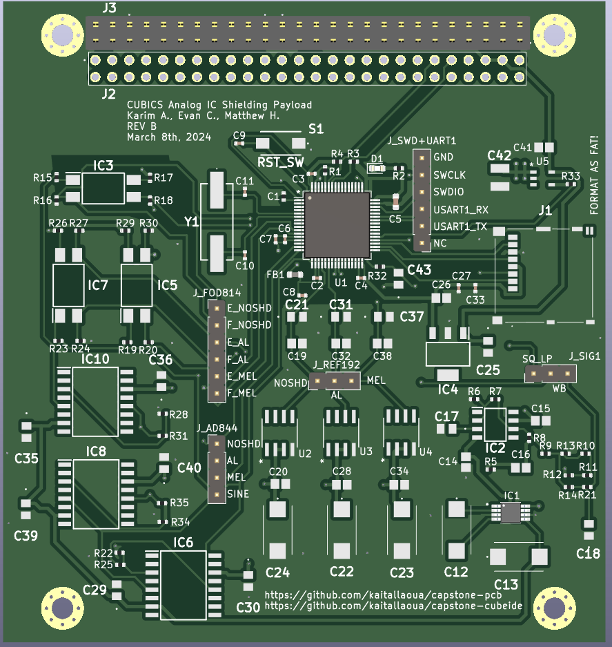

# Comparing Traditional vs. Melanin Shielding for Analog Circuit Reliability in Space

In collaboration with the University of Saskatchewan, we are contributing a payload board for the CubeSats Initiative in Canada for STEM (CUBICS). A CubeSat is a low cost, small and approachable design for students “to engage in an end-to-end space mission adapted to their needs and their level of comfort, expertise and readiness” (asc-csa.gc.ca). Our payload studies the effects of space radiation on commonly used surface mount analog Integrated Circuits (IC’s) in Low Earth Orbit (LEO). We compare traditional aluminium shielding and melanin shielding to see which provides a better effectiveness to weight ratio. 

## Front Copper Layer

## Back Copper Layer

## Front PCB

## Back PCB 

